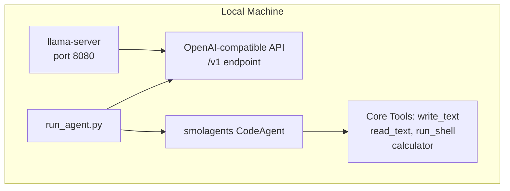

# Setup Guide: smolagents + llama.cpp

This guide sets up Hugging Face smolagents to run against a local llama.cpp server with OpenAI-compatible API.

## Requirements

- Python 3.10+
- [uv](https://docs.astral.sh/uv/) package manager
- llama.cpp server running locally

## Quick Start

### 1. Verify llama-server is Running

```bash
curl -sS http://127.0.0.1:8080/v1/models
```

Expected output:
```json
{
  "object": "list",
  "data": [
    {
      "id": "Qwen3-4B-Instruct-2507-Q4_K_M.gguf",
      "object": "model"
    }
  ]
}
```

### 2. Install Dependencies

```bash
uv venv
uv pip install "smolagents[toolkit]"
```

### 3. Run the Agent

```bash
uv run python run_agent.py
```

## Configuration

### Model Settings

The agent is configured for small models (4B parameters):

```python
model = OpenAIServerModel(
    model_id="Qwen3-4B-Instruct-2507-Q4_K_M.gguf",
    api_base="http://127.0.0.1:8080/v1",
    api_key="local",
    temperature=0.1,  # Low temperature for reliability
)
```

### Why temperature=0.1?

- 4B models are prone to hallucination at higher temperatures
- Low temperature (0.0-0.3) produces more deterministic outputs
- Essential for code generation tasks

## Troubleshooting

### Connection Errors

1. Verify llama-server is running: `ps aux | grep llama-server`
2. Check the port: `curl -sS http://127.0.0.1:8080/v1/models`
3. Ensure `api_base` includes `/v1`

### Model Not Found

Get the correct model_id:
```bash
curl -sS http://127.0.0.1:8080/v1/models | jq '.data[0].id'
```

### Slow Response

- Shorten prompts
- Keep conversation history short
- Reduce context window in llama-server (`-c` parameter)

## Architecture


