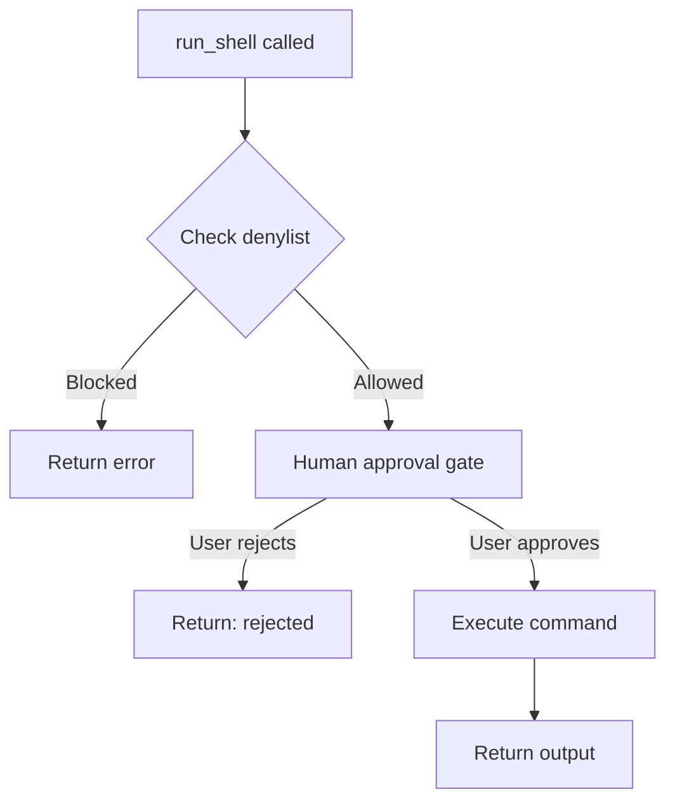

# Core Tools Reference

This project uses 4 custom tools optimized for 4B models. Keeping tools minimal (3-6) improves reliability with smaller models.

## Tool Overview

| Tool | Purpose | File |
|------|---------|------|
| [`write_text`](../tools_local.py) | Create/edit files | `tools_local.py` |
| [`read_text`](../tools_local.py) | Inspect files | `tools_local.py` |
| [`run_shell`](../tools_local.py) | Run shell commands | `tools_local.py` |
| [`calculator`](../run_agent.py) | Simple math | `run_agent.py` |

---

## write_text(path, content)

Write UTF-8 text to a file. Creates parent directories if needed.

```python
write_text(path="src/main.py", content="# Hello World\nprint('hi')")
```

**Parameters:**
- `path` (str): File path relative to current directory
- `content` (str): Text content to write

**Returns:** Confirmation message with bytes written

---

## read_text(path)

Read UTF-8 text from a file. Use to verify files created by the agent.

```python
content = read_text("README.md")
print(content)
```

**Parameters:**
- `path` (str): File path relative to current directory

**Returns:** File contents as string, or error message

---

## run_shell(cmd)

Execute shell commands with **two-layer safety**.

### Safety Layer 1: Denylist

These commands are always blocked:
- `rm`, `rmdir` - file deletion
- `sudo`, `su` - privilege escalation
- `chmod`, `chown` - permission changes

### Safety Layer 2: Human Approval Gate

Every non-blocked command requires user approval:

```
============================================================
Agent wants to run: git status
============================================================
Approve? [y/N]: 
```

### Example Usage

```python
# Safe commands (require approval)
run_shell("git status")
run_shell("pytest")
run_shell("ls -la")

# Blocked commands (always rejected)
run_shell("rm test.txt")  # Error: blocked for safety
```

**Parameters:**
- `cmd` (str): Shell command to execute

**Returns:** Command output (stdout + stderr) or rejection message

### Flow Diagram



---

## calculator(a, b)

Multiply two integers. Example tool for testing.

```python
result = calculator(5, 3)  # Returns 15
```

---

## Creating Custom Tools

smolagents uses the `@tool` decorator. Tools must have proper docstrings:

```python
from smolagents import tool

@tool
def my_tool(param: str) -> str:
    """Brief description of what the tool does.
    
    Args:
        param: Description of the parameter.
    
    Returns:
        Description of the return value.
    """
    # Implementation
    return "result"
```

**Important:** The docstring is used by the model to understand the tool. Always include:
1. Brief description in first line
2. `Args:` section with parameter descriptions
3. `Returns:` section describing the output

## Best Practices for 4B Models

1. **Keep tools simple** - Each tool should do one thing
2. **Clear docstrings** - The model relies on these
3. **Return strings** - Easier for model to process
4. **Handle errors gracefully** - Return error messages, don't raise exceptions
5. **Minimize tool count** - 3-6 tools optimal for small models
